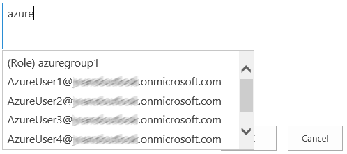

## Use case

AzureCP is useful when SharePoint is federated with Azure Active Directory using [WS-Federation](https://docs.microsoft.com/en-us/azure/active-directory/saas-apps/sharepoint-on-premises-tutorial) or [OpenID Connect](https://docs.microsoft.com/en-us/sharepoint/security-for-sharepoint-server/oidc-1-0-authentication).  
It runs inside SharePoint and queries your Azure Active Directory tenant(s) to find users and groups:

## Compatibility

AzureCP is fully compatible with all the supported versions of SharePoint Server: SharePoint Subscription, SharePoint 2019, SharePoint 2016 and SharePoint 2013.

## Prerequisites

- AzureCP 18+ requires at least [.NET Framework 4.7.2](https://dotnet.microsoft.com/en-us/download/dotnet-framework/net472) on all SharePoint servers.
- AzureCP 17 requires at least [.NET Framework 4.6.1](https://dotnet.microsoft.com/en-us/download/dotnet-framework/net461) on all SharePoint servers.
- **All** SharePoint servers need to be able to connect to Internet. [Read this]() if you need to configure a proxy.
- Azure AD administrator needs to [create an app registration]() for AzureCP.
- AzureCP requires permissions Group.Read.All and User.Read.All in Azure AD.

## Features

- Fix the search in the people picker.
- Get group membership of Azure AD users (augmentation).
- Query multiple Azure Active Directory tenants in parallel.
- Populate the metadata (e.g. email, display name) of the entities.
- Easy to configure through PowerShell or administration pages.
- No dependency on any SharePoint service application.

## Customization

AzureCP is highly customizable to adapt to your requirements:

- Connect to your Azure Active Directory tenant using either a client secret or a certificate.
- Customize the display of the results in the people picker.
- Customize the claim types and their mapping with Azure AD objects.
- Enable/disable augmentation.
- Enable/disable connection to Azure AD, to keep AzureCP running with limited functionality if connectivity with Azure AD is lost.
- Developers can deeply [customize AzureCP]() to meet specific needs.
