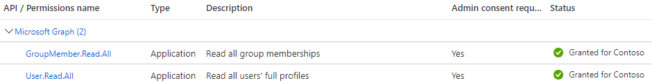

<!-- ## Prerequisites

If you are not a global administrator, you need to have permissions to [create an app registration](https://docs.microsoft.com/en-us/azure/active-directory/roles/custom-available-permissions) and to [grant it tenant-wide admin consent](https://docs.microsoft.com/en-us/azure/active-directory/roles/custom-consent-permissions#granting-permissions-to-apps-on-behalf-of-all-admin-consent) in your Azure Active Directory tenant. 
-->

## Permissions required

AzureCP requires permissions `GroupMember.Read.All` and `User.Read.All` of type application (not delegated):



## Create the app registration

You can register the application using either:

- The [Azure portal]().
- [m3655 cli]().
- [az cli]().

### Create the app registration using the Azure portal

1. Sign-in to your [Azure Active Directory tenant](https://aad.portal.azure.com/).
1. Go to "App Registrations" > "New registration" > Type the following information:
    * Name: AzureCP
    * Supported account types: "Accounts in this organizational directory only (Single tenant)"
1. Click on "Register"
1. Click on "API permissions"
    * Remove the default permission.
    * Add a permission > Select "Microsoft Graph" > "Application permissions". Select `GroupMember.Read.All` and `User.Read.All`.
    * Click on "Grant admin consent for TenantName" > Yes
1. Click on "Certificates & secrets": AzureCP supports both a certificate and a secret, choose either option depending on your needs.

### Create the app registration using m365 cli

[M365 cli](https://pnp.github.io/cli-microsoft365/) makes the registration very simple: It takes only 1 command to create the application, create a secret, set the permissions and grant the admin consent&ast;.  
&ast;: The ability to grant the admin consent was introduced in [version 5.7](https://pnp.github.io/cli-microsoft365/about/release-notes/#v570), with parameter `--grantAdminConsent`.

```bash
m365 login
# The command will print all the information that AzureCP needs to connect.
m365 aad app add --name "AzureCP" --withSecret --apisApplication 'https://graph.microsoft.com/User.Read.All,https://graph.microsoft.com/GroupMember.Read.All' --grantAdminConsent
```

### Create the app registration using az cli

This bash script creates the application, adds a secret, sets the permissions and grants the admin consent.  
It can be used in Azure cloud shell or in a local shell:

```bash
# Sign-in to Azure AD tenant. Use --allow-no-subscriptions if it doesn't have a subscription
az login --allow-no-subscriptions

appName="AzureCP"

echo "Creating application '$appName'..."
az ad app create --display-name "$appName" --key-type Password --credential-description 'client secret'
appId=$(az ad app list --display-name "$appName" --query '[].[appId]' -o tsv)

echo "Creating service principal for application id '$appId'..."
az ad sp create --id $appId
# Get the objectId of the service principal, needed to grant the required permissions
spObjectId=$(az ad sp list --filter "appId eq '$appId'" --query '[].[appId, objectId, appDisplayName]' -o tsv | cut -f2)
echo "Application '$appName' was created with client id '$appId', and its service principal with objectId '$spObjectId'"

# Create a secret
appSecret=$(az ad app credential reset --id $appId -o tsv | cut -f3)

# Retrieve the id of the permissions to grant
userPermId=$(az ad sp show --id 00000003-0000-0000-c000-000000000000 --query "appRoles[?value=='User.Read.All'].id" --output tsv)
groupPermId=$(az ad sp show --id 00000003-0000-0000-c000-000000000000 --query "appRoles[?value=='GroupMember.Read.All'].id" --output tsv)
msGraphResourceId=$(az ad sp show --id 00000003-0000-0000-c000-000000000000 --query "objectId" --output tsv)

# Add the permissions required to the definition of the application (optional as it is just a declaration of the permissions needed)
az ad app update --id $appId --required-resource-accesses "[{
        \"resourceAppId\": \"00000003-0000-0000-c000-000000000000\",
        \"resourceAccess\": [{
                        \"id\": \"$userPermId\",
                        \"type\": \"Role\"
                },
                {
                        \"id\": \"$groupPermId\",
                        \"type\": \"Role\"
                }
        ]
        }]"

echo "Grant admin consent to Microsoft Graph permissions User.Read.All (id '$userPermId') and GroupMember.Read.All (id '$groupPermId') for service principal '$spObjectId'..."
# Wait before granting the permissions to avoid error "Request_ResourceNotFound" on the service principal just created
sleep 20
# Grant permissions to the service principal of the application
az rest --method POST \
        --uri "https://graph.microsoft.com/v1.0/servicePrincipals/$spObjectId/appRoleAssignments" \
        --body "{
        \"principalId\": \"$spObjectId\",
        \"resourceId\": \"$msGraphResourceId\",
        \"appRoleId\": \"$userPermId\"
        }"

az rest --method POST \
        --uri "https://graph.microsoft.com/v1.0/servicePrincipals/$spObjectId/appRoleAssignments" \
        --body "{
        \"principalId\": \"$spObjectId\",
        \"resourceId\": \"$msGraphResourceId\",
        \"appRoleId\": \"$groupPermId\"
        }"

echo "Application $appName was created with client id '$appId' and client secret '$appSecret'"
```
